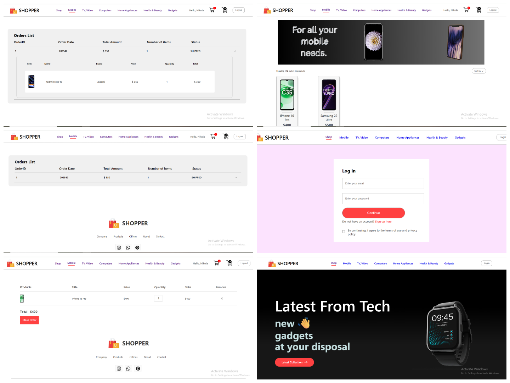
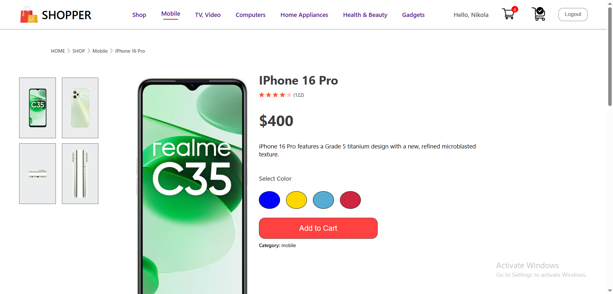
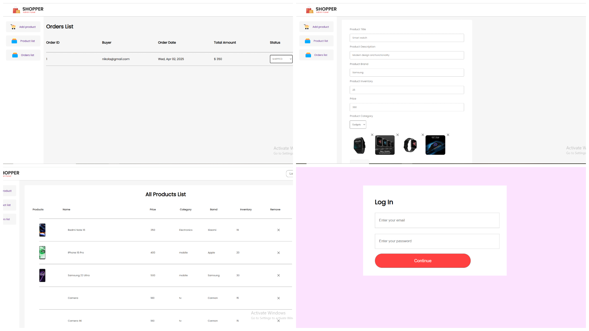

# 🚀 Webshop Frontend

> Two separate frontend React applications. Firstone is for users (buyers) and second is for admin.

---

## 📋 Table of Contents

1. [About The Project](#about)  
2. [Built With](#built)  
3. [Features User](#user)  
4. [Features Admin](#admin)  
5. [Details](#details)  
6. [Left TO DO](#todo)  
7. [Screenshots](#screenshots)  
---

### 📖 About The Project

Short description:
- **Purpose:** To demonstrate createion of user friendly UI and UX interface using modern technologies.
- **Key features:** user application, admin application, user authentication using JWT provided by backend server, shoping cart system, placing orders, order overview.

### 🛠️ Built With

List major frameworks, libraries, and tools:
- [React](https://reactjs.org/)
- [React Router](https://reactrouter.com/)
- [Axios](https://github.com/axios/axios) (for API calls)

### 📱 Features User

- **Responsive Design:** Most pages are optimized for both desktop and mobile.
- **Product Catalog:** Browse through a range of products.
- **Shopping Cart:** Add, remove, and manage items easily.
- **User Authentication:** Login/registration integration.
- **API Integration:** Consumes a backend API for product and order data.

### 💻 Features Admin

- **Responsive Design:** Most pages are optimized for both desktop and mobile.
- **Product Management:** Browse through a range of products add and remove.
- **Orders Overview:** See and manage orders easily.
- **User Authentication:** Login integration.
- **API Integration:** Consumes a backend API for product and order data.

### 🔎 Details

- **React Components:** Utilises core React concept: Components. Everything built is a react component which increases reusability.
- **React Context:** Used for global state management.
- **Local Storage:** Used to store current user information.
- **React Hooks:** Implemented popular hooks like useState, useContext, useEffect in order to add state and other features to functional components.
- **React Router:** Providing implementation of different routes.
- **Axios:** Used for sending HTTP request to backend server.
- **Responsive Design:** Most pages support different resolutions.

### 📖 Left TO DO:
- **Search:** Search, filters and pagination
- **Payment API:** Stripe integration.
- **User Profile:** Interface for managing user information.

### 📷 Screenshots
- **User:**
- 
- 
- **Admin:**
- 
